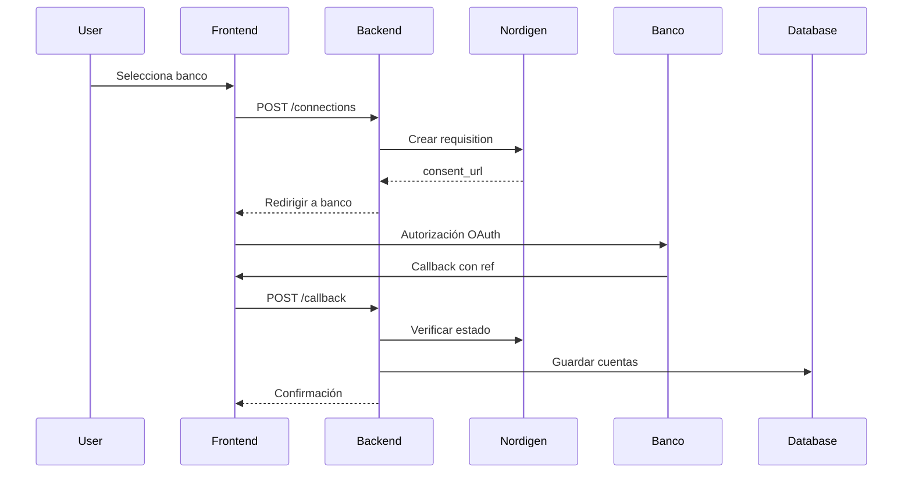

# Open Banking Integration - Nordigen (GoCardless)

## Descripción

Implementación completa de Open Banking utilizando la API de Nordigen (GoCardless Bank Account Data) para conectar automáticamente con bancos europeos y importar transacciones bancarias en tiempo real.

## Características

### 🏦 Conexión Bancaria Automática
- **Soporte para 2000+ bancos europeos** mediante PSD2
- **Flujo OAuth seguro** para autorización bancaria
- **Gestión automática de tokens** y renovación de consentimientos
- **Estado de conexión en tiempo real**

### 📊 Importación de Transacciones
- **Sincronización automática** cada 24 horas configurable
- **Procesamiento idempotente** (evita duplicados)
- **Clasificación automática** de transacciones
- **Histórico de hasta 90 días** (según banco)

### 🔒 Seguridad y Cumplimiento
- **PSD2 compliant** - Regulación europea
- **Tokens seguros** con expiración automática
- **Datos encriptados** en tránsito y reposo
- **Auditoría completa** de accesos

## Arquitectura

```
┌─────────────────┐    ┌─────────────────┐    ┌─────────────────┐
│   Frontend      │    │   Backend       │    │   Nordigen API  │
│   (Next.js)     │◄──►│   (FastAPI)     │◄──►│   (GoCardless)  │
└─────────────────┘    └─────────────────┘    └─────────────────┘
                              │
                              ▼
                       ┌─────────────────┐
                       │   Database      │
                       │   (SQLite)      │
                       └─────────────────┘
```

## Instalación y Configuración

### 1. Dependencias Backend

```bash
pip install httpx apscheduler
```

### 2. Variables de Entorno

Crear archivo `.env` con las credenciales de Nordigen:

```bash
# Nordigen (GoCardless) Credentials
NORDIGEN_SECRET_ID=your-nordigen-secret-id
NORDIGEN_SECRET_KEY=your-nordigen-secret-key
```

**Obtener credenciales:**
1. Registrarse en [GoCardless Bank Account Data](https://bankaccountdata.gocardless.com/)
2. Crear una aplicación en el portal de desarrolladores
3. Copiar Secret ID y Secret Key

### 3. Configuración de Base de Datos

Los modelos se actualizan automáticamente. Para forzar la actualización:

```bash
curl http://localhost:8000/init-viability-tables
```

### 4. Iniciar Scheduler (Opcional)

Para sincronización automática, agregar al `main.py`:

```python
from .scheduler import start_scheduler

@app.on_event("startup")
def startup_event():
    start_scheduler()
```

## Uso

### 1. Conectar Banco

```bash
# Frontend: Navegar a /bank-connections
# Seleccionar banco → Autorizar → Callback automático
```

### 2. API Endpoints

#### Obtener Instituciones
```bash
GET /openbanking/institutions?country_code=ES
```

#### Crear Conexión
```bash
POST /openbanking/connections
{
  "institution_id": "BBVA_BBVAESMMXXX",
  "redirect_url": "http://localhost:3000/bank-connections/callback"
}
```

#### Sincronizar Transacciones
```bash
POST /openbanking/connections/{connection_id}/sync
{
  "days_back": 30
}
```

#### Listar Conexiones
```bash
GET /openbanking/connections
```

### 3. Flujo de Autorización



## Estructura de Archivos

```
app/
├── openbanking/
│   ├── __init__.py
│   └── clients/
│       ├── __init__.py
│       └── nordigen_client.py      # Cliente API Nordigen
├── routers/
│   └── openbanking.py              # Endpoints REST
├── models.py                       # Modelos DB actualizados
└── scheduler.py                    # Sincronización automática

inmuebles-web/
└── app/
    └── bank-connections/
        ├── page.tsx                # Página principal
        └── callback/
            └── page.tsx            # Manejo de callbacks
```

## Modelos de Datos

### BankConnection

```python
class BankConnection(SQLModel, table=True):
    id: int
    user_id: int
    institution_id: str             # ID del banco en Nordigen
    institution_name: str
    requisition_id: str             # ID de requisición
    consent_status: str             # CR, GC, UA, RJ, EX, GA, SA, LN
    is_active: bool
    auto_sync_enabled: bool
    sync_frequency_hours: int       # Frecuencia de sync
    last_sync: datetime
```

### BankAccount

```python
class BankAccount(SQLModel, table=True):
    id: int
    connection_id: int
    account_id: str                 # ID en Nordigen
    iban: str
    account_name: str
    available_balance: float
    current_balance: float
    last_transaction_sync: datetime
```

### FinancialMovement (Actualizado)

```python
class FinancialMovement(SQLModel, table=True):
    # ... campos existentes ...
    external_id: str                # ID único del banco
    bank_account_id: str           # Cuenta origen
    source: str                    # "nordigen", "bankinter", "manual"
```

## Estados de Conexión

| Estado | Descripción |
|--------|-------------|
| `CR` | Created - Requisición creada |
| `GC` | Giving Consent - Dando consentimiento |
| `UA` | Undergoing Authentication - Autenticando |
| `RJ` | Rejected - Rechazado por el usuario |
| `EX` | Expired - Consentimiento expirado |
| `GA` | Granting Access - Acceso concedido |
| `SA` | Selecting Accounts - Seleccionando cuentas |
| `LN` | Linked - Completamente conectado ✅ |

## Sincronización Automática

### Configuración

```python
# Frecuencia configurable por conexión
connection.sync_frequency_hours = 24  # Cada 24 horas
connection.auto_sync_enabled = True   # Activar/desactivar
```

### Jobs del Scheduler

1. **Sync All Connections** - Cada hora
   - Verifica conexiones activas
   - Sincroniza si es necesario
   - Maneja errores automáticamente

2. **Cleanup Expired** - Cada día
   - Desactiva conexiones expiradas
   - Verifica estado en Nordigen
   - Limpia datos obsoletos

## Manejo de Errores

### Errores Comunes

#### Consentimiento Expirado
```json
{
  "detail": "Consentimiento no completado. Estado: EX",
  "error_type": "consent_expired"
}
```

**Solución:** Renovar conexión desde frontend

#### Banco No Disponible
```json
{
  "detail": "Error obteniendo instituciones: Institution not found",
  "error_type": "institution_error"
}
```

**Solución:** Verificar `country_code` y disponibilidad del banco

#### Rate Limiting
```json
{
  "detail": "Too many requests",
  "error_type": "rate_limit"
}
```

**Solución:** Implementar retry con backoff exponencial

### Logging

```python
import logging

logger = logging.getLogger(__name__)

# Configurar nivel
logging.basicConfig(level=logging.INFO)
```

## Testing

### Test Manual

```bash
# 1. Crear conexión de prueba
curl -X POST http://localhost:8000/openbanking/connections \
  -H "Authorization: Bearer YOUR_TOKEN" \
  -H "Content-Type: application/json" \
  -d '{
    "institution_id": "SANDBOX_SFIN0000",
    "redirect_url": "http://localhost:3000/bank-connections/callback"
  }'

# 2. Verificar instituciones
curl http://localhost:8000/openbanking/institutions?country_code=ES

# 3. Sincronizar manualmente
curl -X POST http://localhost:8000/openbanking/connections/1/sync \
  -H "Authorization: Bearer YOUR_TOKEN" \
  -d '{"days_back": 7}'
```

### Test de Frontend

```bash
cd inmuebles-web
npm run dev

# Navegar a:
# http://localhost:3000/bank-connections
```

## Monitoreo

### Métricas Importantes

1. **Conexiones Activas**
   ```sql
   SELECT COUNT(*) FROM bankconnection WHERE is_active = true;
   ```

2. **Últimas Sincronizaciones**
   ```sql
   SELECT institution_name, last_sync, sync_status 
   FROM bankconnection 
   ORDER BY last_sync DESC;
   ```

3. **Transacciones Importadas**
   ```sql
   SELECT COUNT(*) FROM financialmovement 
   WHERE source = 'nordigen' 
   AND date >= date('now', '-30 days');
   ```

### Dashboard de Estado

El frontend incluye un dashboard con:
- Estado de conexiones en tiempo real
- Últimas sincronizaciones
- Errores y alertas
- Configuración de auto-sync

## Seguridad

### Buenas Prácticas

1. **Tokens Seguros**
   - Nunca logear tokens de acceso
   - Renovación automática antes de expiración
   - Revocación inmediata en errores críticos

2. **Datos Sensibles**
   - Encriptar IBANs en base de datos
   - No almacenar credenciales bancarias
   - Auditoría de accesos a datos financieros

3. **Validación de Entrada**
   - Validar todos los parámetros de API
   - Sanitizar datos de bancos externos
   - Rate limiting en endpoints públicos

### Cumplimiento PSD2

- ✅ Consentimiento explícito del usuario
- ✅ Acceso limitado a 90 días máximo
- ✅ Revocación de consentimiento
- ✅ Auditoría completa de accesos
- ✅ Notificación de errores al usuario

## Soporte de Bancos

### España (ES) - Principales

- **BBVA** - `BBVA_BBVAESMMXXX`
- **Santander** - `SANTANDER_BSCHESMMXXX`
- **CaixaBank** - `CAIXABANK_CAIXESBBXXX`
- **Bankinter** - `BANKINTER_BKBKESMMXXX`
- **ING** - `ING_INGDESMMXXX`
- **OpenBank** - `OPENBANK_OPENESMMXXX`

### Sandbox para Testing

- **Sandbox** - `SANDBOX_SFIN0000`

## Limitaciones

1. **Límites de API**
   - 100 requisiciones/día (plan gratuito)
   - 1000 requests/día por conexión
   - Histórico máximo: 90 días

2. **Bancos Soportados**
   - Solo PSD2 compatible (UE/EEE)
   - Algunos bancos requieren confirmación adicional
   - Disponibilidad puede variar

3. **Datos Disponibles**
   - Transacciones y saldos únicamente
   - No información de productos/préstamos
   - Metadatos limitados según banco

## Troubleshooting

### Problemas Frecuentes

#### "Institution not found"
- Verificar código de país correcto
- Comprobar disponibilidad en [documentación oficial](https://nordigen.com/en/coverage/)

#### "Consent expired"
- Renovar desde frontend
- Verificar configuración de URLs de callback
- Comprobar firewall/proxy

#### "Sync failing"
- Verificar conectividad con Nordigen
- Comprobar logs del scheduler
- Validar tokens no expirados

### Debug Mode

```python
# Activar logging detallado
import logging
logging.getLogger("httpx").setLevel(logging.DEBUG)
logging.getLogger("app.openbanking").setLevel(logging.DEBUG)
```

## Roadmap

### Próximas Mejoras

1. **Categorización Inteligente**
   - ML para clasificación automática
   - Reglas personalizables por usuario
   - Detección de patrones de gasto

2. **Alertas Proactivas**
   - Notificaciones de transacciones grandes
   - Alertas de gastos inusuales
   - Recordatorios de renovación de consentimiento

3. **Analytics Avanzados**
   - Proyecciones de cash flow
   - Comparativas entre cuentas
   - Reportes de rentabilidad

4. **Integración Ampliada**
   - Soporte para más países (UK, FR, DE)
   - APIs adicionales (Plaid, Yodlee)
   - Exportación a contabilidad

---

## Soporte

Para soporte técnico:
- 📧 Email: soporte@inmuebles.com
- 📚 Documentación: [docs.inmuebles.com](https://docs.inmuebles.com)
- 🐛 Issues: [GitHub Issues](https://github.com/inmuebles/issues)

---

*Última actualización: Septiembre 2025*
*Versión: 1.0.0*